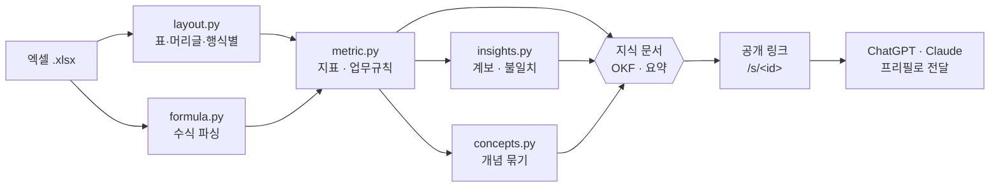

<div align="center">

# ▦ xlmeta

### 스프레드시트를 **LLM이 읽을 수 있는 지식**으로 — 추론 없이, 결정론적으로
<sub>Spreadsheet Knowledge Representation — structure · data · rules · lineage · inconsistencies · concepts. Deterministically, no LLM.</sub>

<br/>

[](https://xlmeta.weaveapp.duckdns.org)
[](#원칙)
[](#빠른-시작)
[](DEPLOY.md)
[](LICENSE)

[**▶ 라이브 데모 열기**](https://xlmeta.weaveapp.duckdns.org) &nbsp;·&nbsp; [빠른 시작](#빠른-시작) &nbsp;·&nbsp; [무엇을 뽑나](#무엇을-뽑나) &nbsp;·&nbsp; [설계](#설계)

</div>

---

회사의 실제 업무 규칙은 규정집이 아니라 **담당자의 엑셀 수식 안**에 있습니다.

```excel
=SUMIFS(실적!G:G, 실적!C:C, A6, 실적!F:F, "승인")
```

*"승인된 건만 원가로 인정한다"* — 이 규칙은 어디에도 문서화되지 않은 채 셀에 박제되어 있습니다.
수식은 이미 **형식 언어**이므로 추론할 필요가 없습니다. **파싱하면 됩니다.**

xlmeta는 복잡한 실무 엑셀을 다른 시스템(DB·문서·AI)으로 옮기기 전에, 그 안의 **구조·데이터·계산
규칙·계산 계보(lineage)·불일치, 그리고 여러 시트에 흩어진 개념까지** 결정론적으로 꺼내 하나의
**지식 표현**으로 만듭니다. 사람도 AI도 그대로 읽습니다.



<br/>

## 라이브 데모

> ### [https://xlmeta.weaveapp.duckdns.org](https://xlmeta.weaveapp.duckdns.org)

엑셀을 올리면 xlmeta가 읽어낸 **구조를 원본과 나란히** 보여줍니다. 파일 없이 **"샘플로 바로 보기"**
버튼으로 즉시 둘러볼 수 있습니다.

- **왼쪽 — 있는 그대로의 엑셀** · 셀을 빈칸·숫자·텍스트·수식 유형으로 색칠한 실제 격자
- **오른쪽 — 읽어낸 구조** · 표 영역·다단 머리글·행 식별 열·소계행·시트 참조. 클릭하면 원본에서 해당 범위가 하이라이트
- **셀 하나를 클릭** · 그 칸의 값·계산식·쓰인 함수·Python 번역·업무 규칙까지 한눈에

## 특징

|  |  |
|---|---|
| **개념 묶기** ⭐ | 여러 시트에 흩어진 **같은 개념**을 하나의 객체로 조립 — 소속·판단·페인·AI 기회·진단·근거(`시트!행`)까지. LLM 없이 |
| **정의 불일치 탐지** ⭐ | 같은 개념(예: 매출)을 두 곳에서 **다르게 계산**한 걸 자동 검출 — *"왜 시트마다 숫자가 다르죠?"* 를 파서가 잡음 |
| **수식 → 업무 규칙** | `SUMIFS` 계열 조건을 *"결재상태 = 승인"* 같은 규칙으로 |
| **계보 · 관계 진단** | 전이 의존 체인(몇 단계) · 순환 참조 · 정의된 이름(named range) |
| **수기 개입 탐지** | 수식이 있어야 할 자리의 상수 → 자동화하면 안 되는 지점 |
| **AI에게 넘기기** | 구조·데이터·규칙·계보·불일치·개념을 한 문서로 AI에 전달 |
| **소계/합계 제외** | 집계 행을 지표로 오인하지 않음 |

## 빠른 시작

```bash
pip install -r requirements.txt   # 의존성은 openpyxl 하나

python make_sample.py             # 데모용 엑셀 생성 → sample_epc_cost.xlsx
python -m xlmeta sample_epc_cost.xlsx -o demo
```

`demo/`에 마크다운 지식 번들이 생성됩니다. 자기 파일로 돌리려면:

```bash
python -m xlmeta report.xlsx -o okf_bundle
```

> 샘플 엑셀은 리포지터리에 바이너리로 넣지 않고 [`make_sample.py`](make_sample.py)로 재현합니다.
> 누구나 같은 입력으로 같은 결과를 다시 만들 수 있습니다.

**웹 화면으로 보기:**

```bash
pip install -r webapp/requirements.txt
python webapp/app.py            # → http://127.0.0.1:5000
```

## 무엇을 뽑나

`발생원가` 지표 하나의 수식 `=SUMIFS(실적!G:G,실적!C:C,A6,실적!F:F,"승인")` 에서 뽑아낸 것:

| 항목 | 뽑아낸 것 |
|---|---|
| **업무 규칙** | 결재상태 `=` 승인 |
| **매칭 키** | 프로젝트코드 = `A6` |
| **원천** | `실적!G:G`(금액) · `실적!C:C`(프로젝트코드) · `실적!F:F`(결재상태) |
| **수기 개입** | `원가현황!D9` 에 사람이 박은 값 `1,875,000,000` |
| **이 지표를 쓰는 곳** | 집행률 · 총투입예상 |

전체 생성물은 [`demo/`](demo/) 에서 볼 수 있습니다 — [`발생원가-M001.md`](demo/metrics/발생원가-M001.md) 부터 보세요.

## 개념 — 여러 시트에 흩어진 걸 하나로

구조와 규칙을 넘어, xlmeta는 **같은 개념이 여러 시트에 흩어져 있는 것을 하나의 객체로 묶습니다.**
프로세스맵·아이디어풀·진단질문 세 시트에 나뉘어 있던 *자동 발주*를 이렇게 조립합니다:

```yaml
개념: 자동 발주
  소속: B. 수요예측·발주
  판단: 시스템 발주를 따를 것인가 조정할 것인가          # ← 프로세스맵
  페인포인트: 담당자가 임의 조정 → 왜 조정했는지 안 남음     # ← 프로세스맵
  AI 기회:
    - [확실] 조정에 판단이 응축 → 조정 사유를 캡처하자        # ← 아이디어풀
  진단 질문:
    - [추정] "자동발주를 왜 조정하세요?" → 조정 이유가 증발    # ← 진단질문
  근거: [프로세스맵!row8, 아이디어풀!row7, 진단질문!row8]
```

이것도 **LLM 없이** 합니다. 작성자가 이미 남긴 연결 토큰(`자동발주(B)`)·프로세스명 일치·헤더→역할
매핑을 파싱할 뿐입니다. 순수 의역(글자가 겹치지 않는 동의어)만 소비하는 LLM의 몫으로 남깁니다.
덕분에 LLM은 매번 여러 시트를 다시 뒤질 필요 없이 **미리 조립된 개념 위에서** 답하면 됩니다.

> 링크 토큰이 풍부한 진단·기획형 엑셀에서 특히 강하고, 자유 텍스트만 있는 파일은 결정론적 연결이 약해집니다.

## AI에게 넘기기

엑셀을 올리면 **구조·실제 데이터·계산 규칙·계보·불일치·개념**을 하나의 문서로 결정론적으로 정리해
공개 페이지(`/s/<id>`)로 만들고, 그 링크를 **ChatGPT·Claude 프리필**에 담아 넘깁니다. 요약이 URL이
아니라 링크가 가리키는 페이지에 있어 주소가 길어지지 않고, AI가 **한 번에 읽어 바로 분석**할 수 있습니다.
(데이터가 담기므로 링크가 공개되면 데이터도 보입니다 — 민감한 파일은 주의.)

> AI는 이 링크를 열어 *"이 시트는 프로젝트코드로 행을 구분하는 표이고, 발생원가·초과율 등 5개
> 값을 실적 시트에서 SUMIFS로 집계한다…"* 같은 요약을 읽고 답합니다.

## 설계

```text
xlmeta/
├── xlmeta/                파이썬 패키지 (의존성: openpyxl)
│   ├── layout.py          표 구조 해석 — 수식을 모름
│   ├── formula.py         수식 파싱 — 표 구조를 모름
│   ├── metric.py          둘을 결합해 지표 구성 — 유일하게 둘 다 앎
│   ├── explain.py         사람·AI용 해석 (한글 설명·함수 문법·Python 변환)
│   ├── summary.py         시트별 결정론적 요약 (AI 프리필 본문)
│   ├── insights.py        계보·불일치 진단 (의존체인·순환·정의된이름·불일치)
│   ├── concepts.py        여러 시트에 흩어진 개념을 하나로 묶음 — 표 구조·수식을 모름
│   ├── evaluate.py        수식 계산값 산출 (SUMIFS 계열·사칙연산)
│   ├── emit_okf.py        OKF v0.1 번들 출력
│   └── __main__.py        CLI 진입점 (python -m xlmeta)
├── webapp/                업로드→분석→공개 요약 Flask 앱
├── make_sample.py         데모용 엑셀 생성기 (재현용)
├── demo/                  예시 출력 번들
├── Dockerfile · docker-compose.yml · DEPLOY.md   배포 (Docker + AWS EC2)
└── docs/                  주석 달린 예시 문서
```

**레이아웃이 먼저입니다.** 셀을 값이 아니라 유형(`. n t f`)으로 바꾼 지도에서 시작하므로, 내용을
몰라도 모양이 보입니다. 표 영역·다단 머리글·소계행을 확정한 뒤에야 수식을 해석합니다.

`layout.py`는 수식 내용을 전혀 모르고, `formula.py`는 표 구조를 전혀 모릅니다. 둘을 아는 모듈은
`metric.py` 하나뿐 — 이 관심사 분리 덕분에 한쪽을 고쳐도 다른 쪽이 깨지지 않습니다.

### 원칙

- **추론하지 않는다.** 같은 입력이면 같은 출력. 재실행으로 검증 가능.
- **침묵 누락 0.** 이름을 확정하지 못하면 추측 대신 제외하고, 지원 못한 항목은 결과에 명시적으로 보고합니다.
- **오프라인.** 핵심 도구의 의존성은 `openpyxl` 하나. 폐쇄망에서 돌고 데이터가 나가지 않습니다.

## 배포

Docker 이미지로 패키징되어 있고, 실제로 **AWS EC2에 라이브로 떠 있습니다**
([https://xlmeta.weaveapp.duckdns.org](https://xlmeta.weaveapp.duckdns.org)).

```bash
docker compose up -d --build     # → http://localhost (EC2에선 공개 주소)
```

`ProxyFix`가 걸려 있어 리버스 프록시(Caddy·ALB) 뒤에서 `https://도메인` 링크가 그대로 나옵니다.
자세한 EC2 절차는 [`DEPLOY.md`](DEPLOY.md) 참고.

## 한계

- 피벗 테이블, 배열 수식, 외부 파일 링크 미지원 (감지 후 보고)
- 행 방향 표(좌측 항목 / 상단 기간)·계층형 행머리글 미지원
- 수식 계산값은 엑셀이 저장한 캐시에만 존재 — openpyxl로 만든 파일은 캐시가 없어 비어 있을 수 있음(규칙 추출과는 무관)

## 라이선스

Apache-2.0

<div align="center"><sub>복잡한 실무 엑셀을 사람과 AI가 함께 읽는 지식으로 — 추론 없이, 재현 가능하게.</sub></div>
